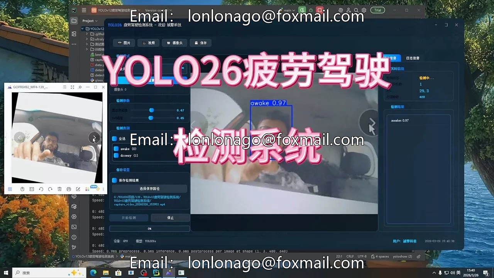
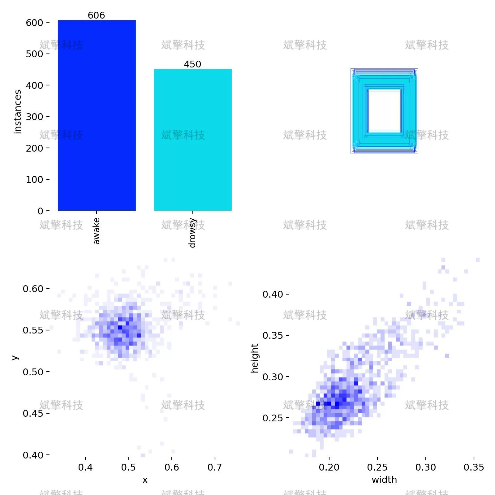
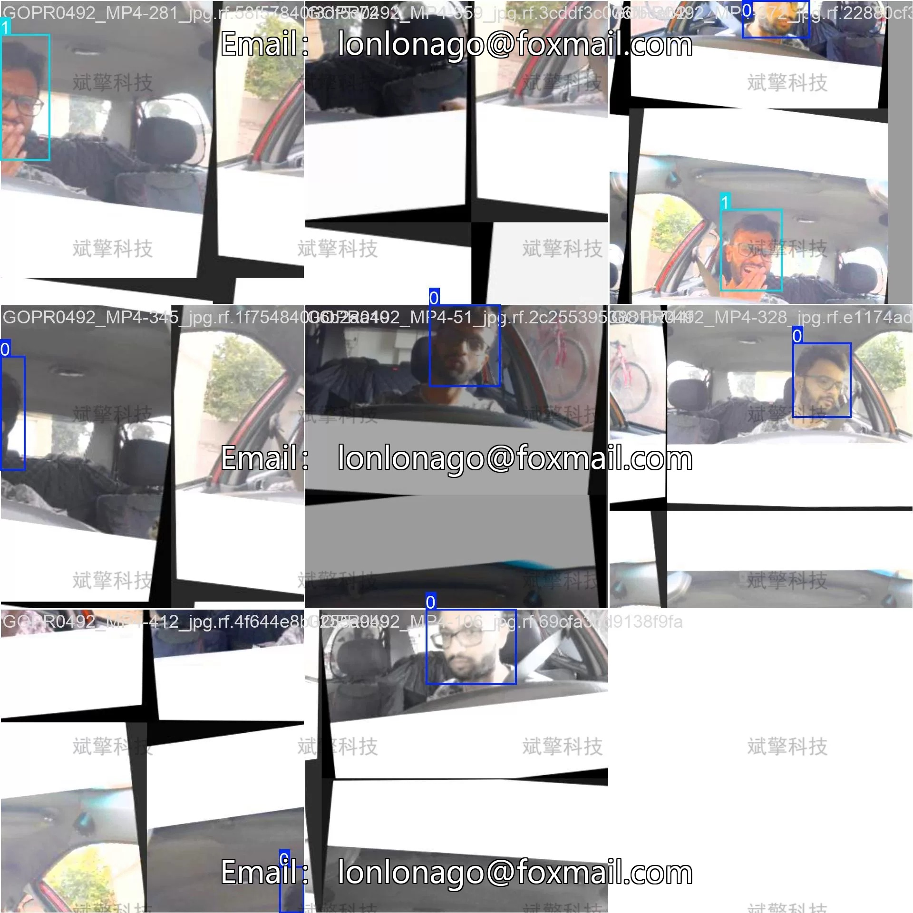
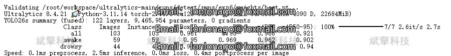
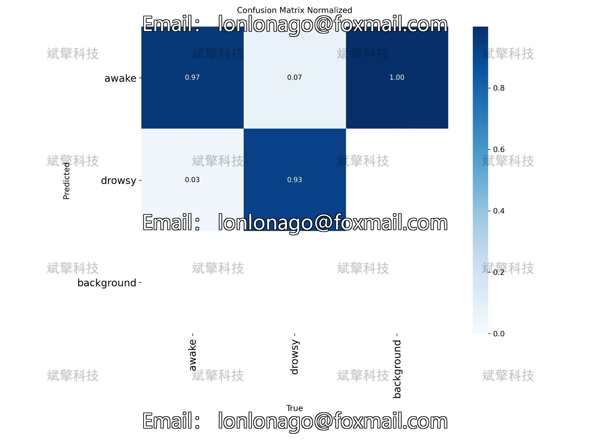
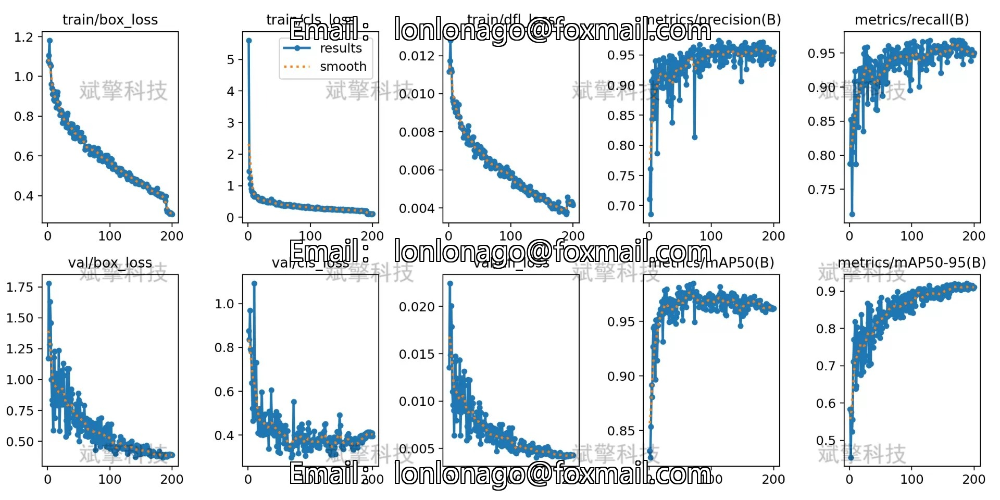
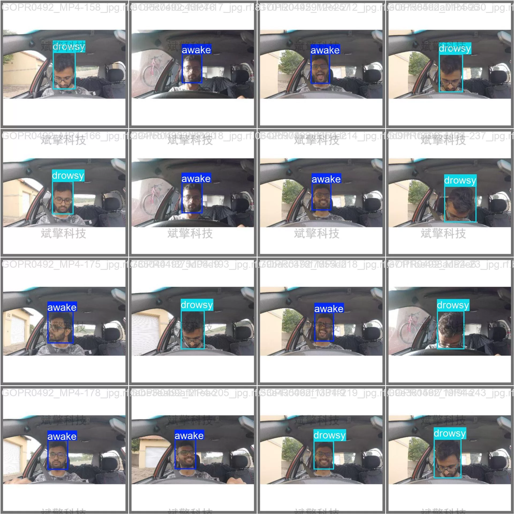
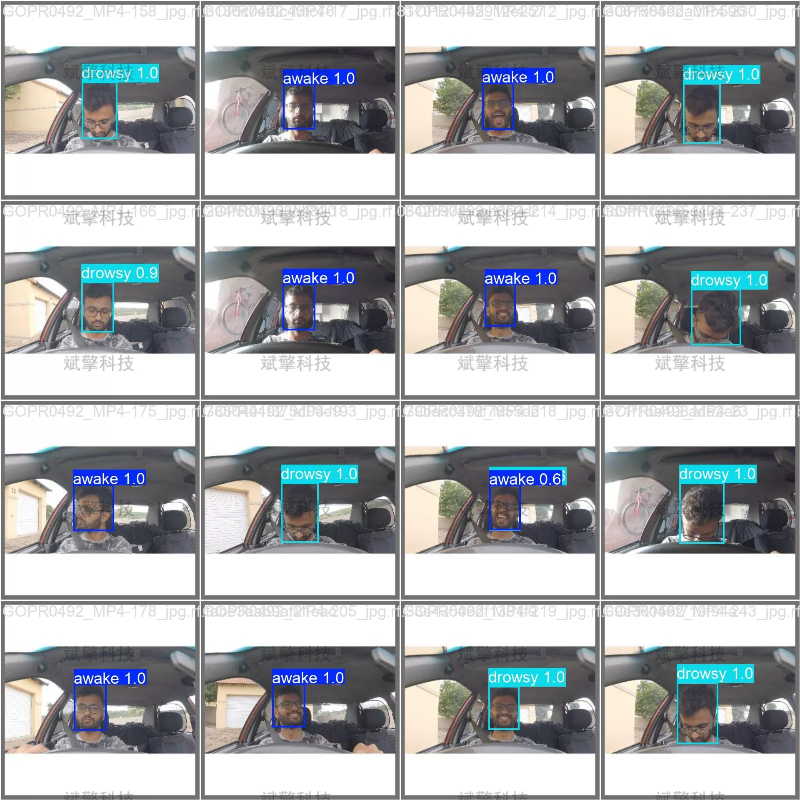

# YOLOv26 Fatigue Driving Detection System | Model + Source Code

## Body

YOLO26 Fatigue Driving Detection System | Model + Source Code

Fatigue driving is one of the main causes of traffic accidents, so developing a real-time and accurate driver status monitoring system is of great significance. This paper builds a driver face state fatigue detection system based on the YOLO26 object detection algorithm, focusing on recognizing "awake" (alert) and "drowsy" (sleepy) states. The system adopts the YOLO26 architecture for model training and optimization, with datasets including 1056 training images, 103 validation images, and 71 test images. Experimental results show that the model achieves an average precision (mAP50) of 0.966 on the validation set, with a recall rate of 0.95, and a推理速度 of only 2.5ms/image, fully meeting the real-time detection requirements. The confusion matrix analysis shows that the model has a recognition accuracy of 97% for alert states and 93% for sleepy states, with a background false alarm rate of 0. The system demonstrates excellent performance in terms of accuracy, speed, and robustness, possessing practical deployment value.

The dataset used by this system contains 2 categories:
awake (alert state): Driver's eyes are normally open, attention focused
drowsy (sleepy state): Driver's eyes are closed or semi-closed, showing signs of fatigue

Dataset division
To ensure the sufficient training and reliability of the model evaluation, the dataset is divided as follows:
Training set: 1056 images, used for model parameter learning and feature extraction
Validation set: 103 images, used for model hyperparameter tuning and performance monitoring
Test set: 71 images, used for the objective evaluation of the final model performance

Free reservation for remote installation. Unsuccessful full refund.
Purchase Enjoy the following resources (with Baidu Cloud automatically unlocked):
YOLO Identification Detection Project Complete Source Code
YOLO format datasets
Training code + UI interface code
Trained model + results image
Software install package
Add WeChat to make a reservation for remote installation (Automatically display WeChat ID after purchase) - Unsuccessful, full refund

⚙️ Core function modules
Detection capability
Image detection: upload and check immediately, returning detection boxes + category information
Video detection: supports video files, analyzing frames accurately
Camera real-time detection: connect USB camera, achieving dynamic monitoring
Interaction and control
Target selection: freely choose one or more categories for detection
Parameter real-time adjustment: adjustable confidence threshold & IoU threshold, flexibly controlling accuracy
Result saving: save images/videos/camera detection results in one click
System and data
User login registration: Support password strength detection + encryption storage
Log recording: automatically records operation and error information (timestamped)

## Images

## Payment

Here is a pay link on Stripe ( https://buy.stripe.com/3cs8yP7sY87d0vu9AB ). Please contact me lonlonago@foxmail.com after funding $89, and I will send you a complete data files , thank you!

